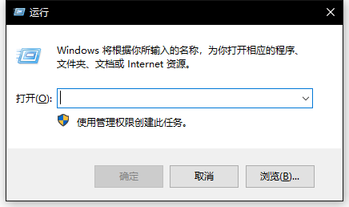
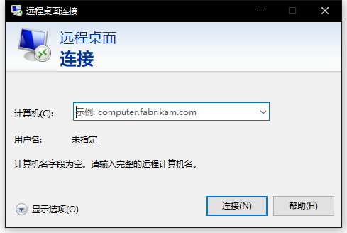
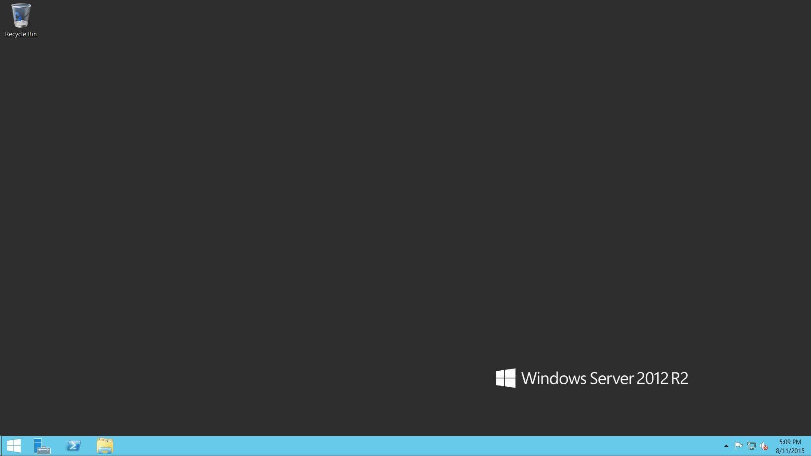

# 准备工作

搭建我的世界服务器是一项非常复杂的过程，在正式开始搭建我的世界服务器之前，我们需要做一些准备工作。

## 自身条件

1. 掌握一定程度的汉语，这对阅读本教程极为重要。
2. 拥有较强的理解能力，这对阅读本教程极为重要。
3. 拥有较强的独立思考能力，这对阅读本教程极为重要。
4. 学习什么是[搜索引擎](SearchEngine.md)，掌握搜索引擎的使用方法。
5. 学习什么是[提问的智慧](How-To-Ask-Questions-The-Smart-Way.md)。

## 外部条件

1. 一台能够访问互联网的计算机。
2. [SpigotMC](https://www.spigotmc.org/) 账号，利于查阅一手资料、购买正版付费插件和获取外网社区帮助。
3. [MCBBS我的世界中文论坛](https://www.mcbbs.net/) 账号，利于查阅经本地化后的资料和获取中文社区帮助。
4. 一台Windows系统的VPS服务器。

## 如何购买一台合适的服务器

本教程建议通过可信度较高的第三方交易平台（如[淘宝](https://www.taobao.com/)）搜索购买我的世界VPS服务器。

### 如何选择服务器配置

搭建我的世界服务器对VPS服务器的CPU性能、内存大小、硬盘速度和网络质量均有较高的要求。

在这里，我们仅对搭建我的世界服务器需要着重关注的硬件参数作讲解，以下内容中的结论均以此为预设情景。

#### CPU

> CPU（Central Processing Unit），即中央处理器，是一台计算机的核心部件。

选择的 CPU 质量的高低对服务器的性能有着至关重要的影响。

**一般的，我们对 CPU 性能的概括有着这样一个简单结论： CPU 单核性能 = IPC * 频率**

##### 什么是 IPC ？
> IPC（Instruction Per Clock），指 CPU 每一时钟周期内所执行指令的多少。

IPC 代表了一代处理器架构的设计性能，一旦该处理器架构设计完成之后，IPC 值就不会再改变了。

##### 什么是 频率 ？

> CPU 的时钟频率，简单说是CPU运算时的工作的频率（1 秒内发生的同步脉冲数）的简称，单位是Hz。

简单的讲，IPC 是 CPU 在每一时钟周期内能够运算的量的大小；频率是 CPU 工作时 1 秒内的时钟周期数。

让我们举个例子：[Intel Xeon X5690](https://ark.intel.com/content/www/cn/zh/ark/products/52576/intel-xeon-processor-x5690-12m-cache-3-46-ghz-6-40-gt-s-intel-qpi.html) 与 [Intel Core i9-9900k](https://ark.intel.com/content/www/cn/zh/ark/products/186605/intel-core-i9-9900k-processor-16m-cache-up-to-5-00-ghz.html) 同样工作于 3.6Ghz 的频率时，很显然地，Intel Core i9-9900k 的运算效果更好。

因此我们可以发现：**在这里，IPC 值的高低起到了决定性的作用，而频率似乎不再高于一切。**

所以，当选择服务器的 CPU 时不应该单单执着于高频率。

##### 什么是 核心 ？

在这里，CPU 核心一般指线程。
> 线程（Thread）是操作系统能够进行运算调度的最小单位。它被包含在进程之中，是进程中的实际运作单位。一条线程指的是进程中一个单一顺序的控制流，一个进程中可以并发多个线程，每条线程并行执行不同的任务。

由于主流的我的世界服务端仅能利用单个线程工作，或对多线程利用的效果不够理想，
所以单个核心的频率在一定程度上决定了我的世界服务器的最大负载量。

**一般的，当你搭建是纯净的、不含模组的服务器时，对单核性能的要求较低；当你搭建是含模组的服务器时，对单核性能的要求较高。**

同时，无论纯净与模组服务器，单个核心的负载能力都是有限的，如果你的玩家人数较多，我们建议你采用跨服的方式，让玩家分别进入多个子服务端，这样可以令多个线程同时工作，以实现负载均衡。

#### 内存

> 内存（Memory）是计算机中重要的部件之一，它是外存储器与CPU进行沟通的桥梁。

在这里，我们需要关注服务器所采用的内存的三个参数。

##### 规格

常见的 DDR4 即代表了目前内存的第4代规格。

**一般的，内存规格代数越大，性能越好。**

##### 频率

> 内存主频和CPU主频一样，用来表示内存的速度，它代表着该内存所能达到的最高工作频率。内存主频是以MHz为单位来计量的。

常见的 2400 Mhz 即是 DDR4 规格下的一种标准内存频率。

**一般的，同等内存规格代数情况下，内存频率越高，性能越好。**

##### 容量

> 内存容量是内存条的关键性参数。内存的容量一般都是2的整次方倍，比如64MB、128MB、256MB等。

**一般的，内存容量越大越能同时运行更多的程序、越有利于系统的运行。**

#### 硬盘

> 硬盘是计算机的外存储设备。

**一般的，我们使用 IOPS 作为衡量硬盘性能的量测方式。**

通常来讲，固态硬盘的 IOPS 比机械硬盘更高，但同容量下，固态硬盘的价格更贵。

**在我的世界当中，地图包含了大量的以4KB为规格存储的数据，对于这种数据，固态硬盘的读写速度可以达到机械硬盘的百倍以上。所以我们推荐尽可能选择 IOPS 高的固态硬盘来搭建我的世界服务器。**

#### 网络

众所周知，我国有三大基础电信业务运营商：中国电信、中国移动和中国联通。
但实际生活中，存在的宽带运营商不止三家。每家运营商所经营的宽带线路质量有所不同。

一般情况下，我们认为我国有四大网络线路：电信、联通、移动和教育网。

通常情况下，只有Google、Amazon和阿里云等大型企业提供的公有云产品所采用的线路质量较高。

对于搭建我的世界服务器来讲，只需接入三线（电信、联通和移动）即可满足绝大部分的需求。

但同时接入三条网络线路即意味着需要同时向三家务运营商购买其运营的网络线路。

**一般的，在同等质量、速率的情况下，接入的线路条数越多，价格越高。**

##### BGP

> BGP 即边界网关协议，是运行于 TCP 上的一种自治系统的路由协议。

当我们同时接入三条运营商的网络线路时，我们会分别得到三家务运营商的网络地址。当购买了一个运营商宽带的玩家访问了另一个运营商的网络地址时，则需要通过该玩家的运营商出口到另一个运营商的网络拓扑当中，这个过程会增加网络延迟。例如，电信宽带的玩家通过联通的IP地址进入服务器，延迟就比通过电信的IP地址进入服务器要高。

因此，我们可以简单地将 BGP 理解为可以融合三家运营商线路的技术，购买了不同运营商宽带的玩家只需要通过同一个网络地址访问服务器，都可以获得最低的网络延迟。

**一般的，在同等质量、速率的情况下，使用 BGP 技术的网络价格比不使用的更高。**

## 连接到服务器远程桌面

在这里，我们假设你已经购买到了一台 Windows 系统的 VPS 服务器。

你将会从服务器提供商处获得一份大致相同的服务器连接信息，例如：
```
ExampleCloud Ex云计算  后台信息  
套餐：Ex 开通日期：1970.01.01
========================
【远程桌面连接地址】
BGP多线：ex.example.com:61389
=========================
【系统信息】
系统：WindowsServer 2012R2
用户名：Administrator
密码：Example!.
为了保障您后台的数据安全，减少被别有用心之人利用的可能性，我们建议您更高更高强度的系统密码，以免造成不必要的损失。
=========================
【游戏连接地址】
BGP多线：ex.example.com:端口
开放端口：61390-61398 九个端口内外对应
=========================
请牢记您的VPS的编号：EX-01
若遇到无法解决的问题或是技术服务的话
请提供VPS编号，这样我们方便识别您的VPS信息
========================
感谢您选择我们，您的支持使我们继续发展下去的动力
```

### Windows 系统

在键盘上找到 “Windows 键“ ，同时按下 “Windows 键” + “R 键”。

会弹出 “运行” 界面，在输入框中输入半角英文字符 “mstsc” ，即可弹出 “远程桌面连接”  界面。

在 “远程桌面连接” 界面当中的 “计算机：”后的输入框中输入刚刚得到的服务器连接信息中的 “远程桌面连接地址”。
点击连接，根据提示输入入刚刚得到的服务器连接信息中的 “用户名” 和 “密码” ，即可连接到服务器远程桌面。

### MacOS 系统

在 Mac 应用商店安装 [Microsoft Remote Desktop 8](https://vpp.itunes.apple.com/us/app/microsoft-remote-desktop-8/id715768417)。

根据软件指引，连接服务器远程桌面。

**注意：若按照上述顺序操作过程中，出现任何错误，请利用[自身条件](#自身条件)中第4条的能力排查错误原因，排除错误。
若仍然无法排除错误，请向你的服务器提供商求助。**

## 安装运行环境

我们假设你已按照之前部分的说明成功进入了服务器远程桌面，那么你会看到一张熟悉的 Windows 系统桌面。



这时，我们需要在服务器上安装以下软件：

[Java SE Development Kit 8](https://www.oracle.com/java/technologies/javase/javase-jdk8-downloads.html)

[Notepad++](https://notepad-plus-plus.org/downloads/)

[BandiZip](https://www.bandisoft.com/bandizip/) 或 [7Zip](https://www.7-zip.org/) 任选其一

[Chrome](https://www.google.cn/intl/zh-CN/chrome/) 或 [FireFox](https://www.firefox.com.cn/) 任选其一

**注意：若安装上述软件出现问题，请查阅该软件的帮助文档，或通过该软件官方求助渠道取得帮助。**

## 完成

此时，你便已经完成了搭建我的世界服务器所必要的全部准备。
